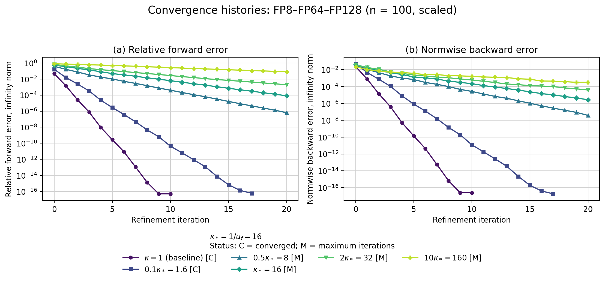
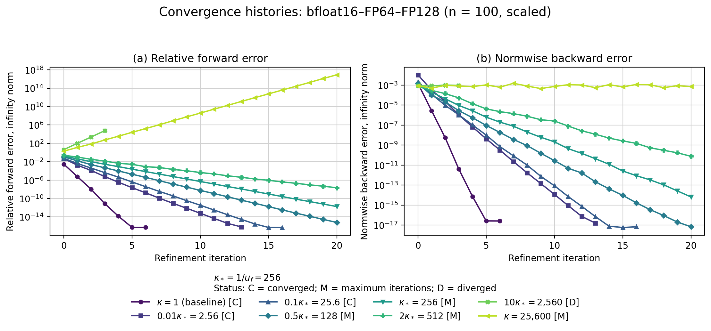

# Introduction

Modern hardware supports several floating-point formats with different
costs, accuracy, and numerical ranges. Low   precision can increase throughput
and reduce memory traffic and energy consumption, but it also introduces
larger rounding errors. Mixed-precision algorithms combine multiple formats
to obtain some of the efficiency of low precision while retaining higher-precision
accuracy [@highamMixedPrecisionAlgorithms2022].

This report studies mixed-precision iterative refinement for nonsingular
linear systems using low precision for LU factorization and higher precision for refinement.
Numerical experiments assess convergence and accuracy across precision triples and condition
numbers. The study focuses on convergence, attainable accuracy, and iteration counts, rather than
wall-clock performance. Several low- and high-precision formats are emulated or implemented in software,
so measured runtimes would not represent performance on hardware with native support for these formats.

# Three-precision iterative refinement

## Algorithm

The implemented method is LU-based three-precision iterative refinement
[@highamMixedPrecisionAlgorithms2022]:

```pseudocode
#| label: algo-mixed-ir
#| html-line-number: true
#| pdf-line-number: true
#| pdf-placement: "H"

\begin{algorithm}
\caption{Three-precision iterative refinement}
\begin{algorithmic}
\Require Nonsingular system $Ax=b$
\State Round $A$ and $b$ to precision $u_f$
\State Compute $PAQ=LU$ in precision $u_f$
\State Solve for $x_0$ using the factors in precision $u_f$
\State Store $x_0$ in precision $u$
\For{$i=0,1,\ldots,i_{\max}-1$}
    \State Compute $r_i=b-Ax_i$ in precision $u_r$
    \State Round $r_i$ to precision $u_f$
    \State Solve for $d_i$ using the factors in precision $u_f$
    \State Store $d_i$ in precision $u$
    \State $x_{i+1} \gets x_i+d_i$ in precision $u$
    \If{$\lVert d_i\rVert_2/\lVert x_i\rVert_2 < u$}
        \State \Return $x_{i+1}$
    \EndIf
\EndFor
\State \Return $x_{i_{\max}}$
\end{algorithmic}
\end{algorithm}
```

@algo-mixed-ir summarizes the core three-precision method. Our implementation
extends the core algorithm with optional residual scaling for limited-range formats,
configurable robustness checks, optional iterate histories, optional residual diagnostics,
and descriptive termination statuses. 


## Precision roles

The algorithm uses three unit roundoffs, typically ordered as

$$
u_r \leq u \leq u_f,
$$

where $u_f$, $u$, and $u_r$ are the unit roundoffs of the factorization, working,
and residual precisions, respectively.


## Convergence and attainable accuracy

Iterative refinement is expected to converge when

$$
\kappa(A)u_f<1.
$$

This is a useful approximate condition; convergence generally slows near this boundary. If the iteration converges, $u$ and $u_r$ determine the attainable accuracy. Higher residual precision reduces residual rounding errors and can improve the forward error [@carsonAcceleratingSolutionLinear2018].

# Experimental setup

The experiments use a common configurable framework in which explicit options configure both the test problem and the mixed-IR algorithm. Each driver selects these configurations, while shared components construct the problem, execute the algorithm, evaluate errors, and record the results.

## Configuration and common settings

Each experimental driver specifies the dimension, condition numbers, and precision types and configures the test problem and algorithm through separate option structures. `TestProblemOptions` controls problem construction, including the matrix family, right-hand-side mode, and random seeds, while `MixedIROptions` controls termination, residual scaling, and storage of iterate histories and residual diagnostics. Unless stated otherwise, the experiments use the common settings in @tbl-common-settings.


| Parameter                           | Common setting                                               |
| ----------------------------------- | ------------------------------------------------------------ |
| Matrix family                       | Dense random SPD                                             |
| Dimension                           | $n=100$                                                      |
| Right-hand side                     | $b_i\sim\mathcal{N}(0,1)$ in FP64                            |
| Random seeds                        | $42$ for matrix construction; $2718$ for the right-hand side |
| Working precision                   | FP64                                                         |
| Reference and measurement precision | FP256                                                        |
| Maximum iterations                  | $20$                                                         |
| Divergence detection                | Enabled; growth factor $10$ over three consecutive steps     |
| Residual scaling                    | Enabled                                                      |
| Iterate histories                   | Enabled                                                      |
| Residual diagnostics                | Disabled                                                     |

: Common experimental settings. {#tbl-common-settings}


The condition numbers and precision triples vary between experimental groups. Residual scaling normalizes the residual before conversion to the factorization precision and rescales the computed correction. It is disabled only for the scaled-unscaled comparison and is discussed later
under [Low-precision limitations and residual scaling](#sec-residual-scaling).

## Test problems 

The test-problem generator independently configures the matrix family and right-hand-side construction. It supports structured rotated-SPD, dense random-SPD, and nonsymmetric random-SVD matrices. Right-hand sides can be formed from an all-ones solution, a random-sign solution, or directly sampled normal entries. Unless stated otherwise, the experiments use dense random-SPD matrices and random-normal FP64 right-hand sides.

The random-SPD matrices have the form 

$$
A = Q\Lambda Q^T,
$$

with orthogonal $Q$ and prescribed condition number $\kappa_2(A)$. An FP256 solve of the stored system provides the reference solution.


## Precision formats

The experiments use the following formats:

| **Format** | **Implementation** | **Significand bits** | **Unit roundoff** |
| ---------- | ------------------ | -------------------- | ----------------- |
| bfloat16   | `CPFloat<8, 8>`    | 8                    | $2^{-8}$          |
| FP16       | `CPFloat<11, 5>`   | 11                   | $2^{-11}$         |
| FP32       | `float`            | 24                   | $2^{-24}$         |
| FP64       | `double`           | 53                   | $2^{-53}$         |
| FP128      | `FP<64>`           | 64                   | $2^{-64}$         |
| FP256      | `FP<192>`          | 192                  | $2^{-192}$        |

: Floating-point formats used in the experiments. {#tbl-precision-formats}

CPFloat simulates bfloat16 and FP16; GMP provides FP128 and FP256. The main experiments use FP64 working precision. Each experiment specifies its factorization and residual precisions.

## Error measures 

For each iterate, we compute

$$
\begin{aligned}
e_i &=
\frac{\lVert x_i-x_{\mathrm{ref}}\rVert_\infty}
     {\lVert x_{\mathrm{ref}}\rVert_\infty},
\\
\eta_i &=
\frac{\lVert b-Ax_i\rVert_\infty}
     {\lVert A\rVert_\infty\lVert x_i\rVert_\infty
      +\lVert b\rVert_\infty}.
\end{aligned}
$$

The forward error $e_i$ and the normwise backward error $\eta_i$ are both evaluated in FP256.

## Termination criteria and statuses

Convergence is determined by the relative correction

$$
\rho_i=\frac{\lVert d_i\rVert_2}{\lVert x_i\rVert_2}.
$$

Refinement terminates with status `converged` when $\rho_i < u$. 
Otherwise, it returns `max_iterations` after 20 iterations, 
`factorization_input_non_finite` if $A$ or $b$ is non-finite
after conversion to the factorization precision, 
`non-finite` if a non-finite value appears later, 
or `diverged` if the correction norm grows by more than a factor
of $10$ for three consecutive iterations.
The iteration limit, growth factor, and required number of consecutive
growth steps are configurable.


## Experimental framework and reproducibility

Each C++ driver defines an experimental group by selecting precision types and configuring
the shared test-problem, mixed-IR, measurement, and output components. 
Helper functions derive output paths, filenames, and common CSV fields from the configuration
and algorithm result. Drivers add only experiment-specific fields, such as iteration histories
or conversion diagnostics.

Each CSV records the run configuration, random seeds, and termination status.
Python scripts validate the raw data and generate plots without modifying it.
Fixed seeds and self-describing outputs allow runs to be repeated and figures
to be regenerated without rerunning the experiments.

# Experimental design

We conducted five groups of experiments to examine how conditioning, precision choices, and residual handling affect the convergence and accuracy of mixed iterative refinement. Unless stated otherwise, they use the common setup described above and vary only the parameters relevant to their objective. @tbl-experimental-design summarizes each group’s purpose, varied parameters, and recorded quantities.

| Experimental group            | Parameters varied                                         | Quantities recorded                                                  | Purpose                                                       |
| ----------------------------- | --------------------------------------------------------- | -------------------------------------------------------------------- | ------------------------------------------------------------- |
| Convergence histories         | Representative $\kappa_2(A)$ values and precision triples | Per-iteration forward error, backward error, relative correction; final status | Examine behavior below, near, and above $\kappa_2(A)u_f=1$.   |
| Condition-number sweep        | $\kappa_2(A)$ and precision triple                        | Final forward and backward errors, iteration count, final status                   | Determine how conditioning affects convergence and accuracy.  |
| Residual-precision comparison | $\kappa_2(A)$ and residual precision                                        | Final forward and backward errors, final status                                          | Measure the benefit of higher residual precision.             |
| Direct-solve comparison       | $\kappa_2(A)$ and solution method                                           | Final forward and backward errors, final status                                          | Compare mixed IR with a direct working-precision solve.       |
| Residual-scaling experiments  | Residual scaling enabled or disabled                      | Error histories and conversion diagnostics                           | Determine whether scaling prevents residual information loss. |

: Overview of the five experimental groups. {#tbl-experimental-design tbl-colwidths="[20,25,27,28]"}


# Results and discussion

## Convergence histories

In this experiment group $u_f$, $u_r$ and $\kappa(A)$ are varied; $u$ and other common settings remain fixed. For each configuration, the forward error, backward error, and relative correction are recorded after every refinement step, Relative corrections are omitted from the final plots.
These histories show the convergence rate, attained accuracy, and termination status.

For each factorization precision, the driver defines the reference condition number

$$
\kappa_* = u_f^{-1}
$$

and tests $\kappa_2(A)=1$ together with representative values below, near, and above $\kappa_*$. Condition numbers are chosen as multiples of $\kappa_*$ to provide a common relative scale across factorization formats. The condition $\kappa_2(A)u_f<1$ serves as an approximate theoretical reference. 

Curve labels include termination status. `C`, `M`, `D`, and `F` denote convergence, the iteration limit, detected divergence, and non-finite factorization input, respectively.

Seven precision configurations were tested. Four are presented: FP8–FP64–FP128, bfloat16–FP64–FP128, FP16–FP64–FP64, and FP16–FP64–FP128. They were selected to show qualitatively distinct effects: the FP8 stress case, the different factorization behavior of bfloat16 and FP16, and the effect of increasing the residual precision from FP64 to FP128. The omitted FP32 configurations are summarized in the text as higher-factorization-precision counterparts.

The convergence results are shown in Figure @fig-convergence-histories

::: {#fig-convergence-histories layout-ncol=1 fig-pos="p" fig-align="center"}
{#fig-convergence-fp8 width=81%}

{#fig-convergence-bfloat16 width=81%}

{#fig-convergence-fp16-fp128 width=81%}

{#fig-convergence-fp16-fp64 width=81%}
:::

### Interpretation

Across all precison triples, convergence slows as the condition number increases.
Runs well below $\kappa_*$ converge rapidly. Runs near $\kappa_*$ require more
iterations, while rusn sufficiently far above it reach the iteration limit or diverge.
The  transition occurs at different multiples of $\kappa_*$; which confirms that $\kappa_* = u_f^{-1}$
is an approximate condition, and not a fixed convergence boundary.

The following comparisons examine the effects of $u_f$ and $u_r$.
$u_f$ primarily affects the convergence rate and practical convergence region.
$u_r$ primarily affects the attainable forward accuracy.


#### Effect of $u_f$

FP16–FP64–FP128 and bfloat16–FP64–FP128 differ only in the factorization format. FP16 has the smaller unit roundoff, while bfloat16 has the larger exponent range. Their reference condition numbers are

$$
\kappa_{\mathrm{FP16}}=2048,
\qquad
\kappa_{\mathrm{bfloat16}}=256.
$$

The configurations are compared at equal values of $\kappa/\kappa_*$ because their absolute reference condition numbers differ.

Both configurations converge at $\kappa=1$, $0.01\kappa_*$, and $0.1\kappa_*$. FP16 requires fewer iterations and also converges at $0.5\kappa_*$, where the bfloat16 configuration reaches the iteration limit. Neither configuration converges within 20 iterations at $\kappa_*$ or above, and both diverge at $10\kappa_*$.

FP16 therefore provides faster convergence and a larger practical convergence region relative to $\kappa_*$ in these experiments. Its smaller exponent range causes no disadvantage here because residual scaling mitigates underflow when the residual is converted to the factorization format. Without scaling, the FP16 configuration reaches an early accuracy plateau. This behavior is examined in the residual-scaling experiment below. Neither configuration encounters a range failure in the factorization input, so the present comparison primarily reflects the smaller unit roundoff of FP16.

#### Effect of $u_r$

FP16–FP64–FP64 and FP16–FP64–FP128 differ only in $u_r$. Their histories are nearly identical until the errors approach FP64 accuracy.

With FP64 residuals, the forward error reaches a condition-dependent plateau. The runs from $0.01\kappa_*$ to $\kappa_*$ therefore reach the iteration limit. With FP128 residuals, the forward error continues to decrease: the runs through $0.5\kappa_*$ converge with errors of order $10^{-16}$. At $\kappa_*$, the error reaches approximately $8\times10^{-16}$ but the stopping criterion is not satisfied within 20 iterations. The FP128 residuals also produce lower backward errors in the stable cases.

The residual precision has little effect after these accuracy limits are reached. At $2\kappa_*$ and above, both configurations show nearly identical behavior, and both diverge at $10\kappa_*$. Increasing the residual precision therefore improves the attainable accuracy and termination behavior of convergent runs, but does not correct instability caused by an insufficiently accurate factorization.


#### FP8 stress case

FP8–FP64–FP128 tests the limits of low-precision factorization. For FP8,

$$
\kappa_* = u_f^{-1} = 16.
$$

The runs at $\kappa=1$ and $0.1\kappa_*$ converge in 10 and 17 refinement steps, respectively. At $0.5\kappa_*$, the errors continue to decrease but do not reach working-precision accuracy within 20 steps. Convergence becomes progressively slower as the condition number increases; the runs from $\kappa_*$ to $10\kappa_*$ also reach the iteration limit.

At $100\kappa_*$, conversion of the matrix to FP8 produces non-finite entries. Factorization therefore terminates before an iteration history is generated, and this run is not shown in Figure @fig-convergence-histories. FP8 is thus limited by both its low factorization accuracy and its small exponent range.

#### Omitted FP32 configurations

The omitted FP32 results reproduce the behavior of the corresponding FP16 configurations. With FP64 residuals, the forward error reaches condition-dependent plateaus, although the backward error approaches working-precision accuracy. With FP128 residuals, these plateaus disappear in the convergent cases and more runs satisfy the stopping criterion.

Increasing residual precision therefore has the same effect with FP16 and FP32 factorization: it has little influence on early convergence but lowers the attainable forward error. Increasing factorization precision instead shifts $\kappa_*=u_f^{-1}$ to larger absolute condition numbers and extends the observed convergence region. Thus, factorization precision primarily controls convergence, while residual precision primarily controls attainable accuracy.


## Condition-number sweep

...

## Residual-precision comparison

...

## Direct-solve comparison

...

## Low-precision limitations and residual scaling {#sec-residual-scaling}

...

# Conclusion

...

# References {.unnumbered}