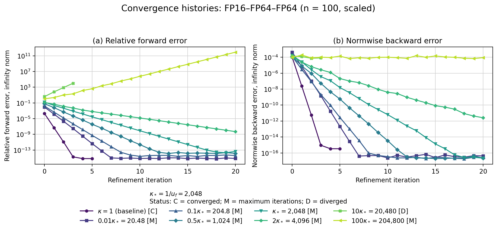
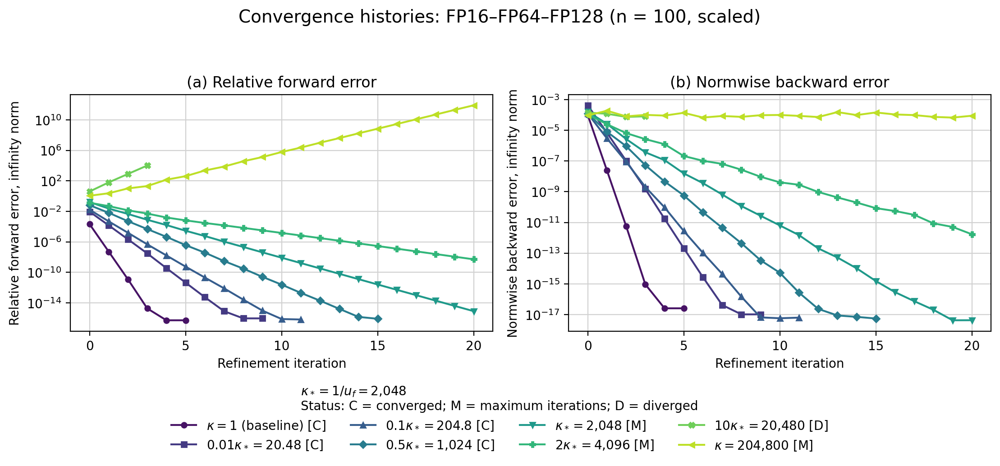
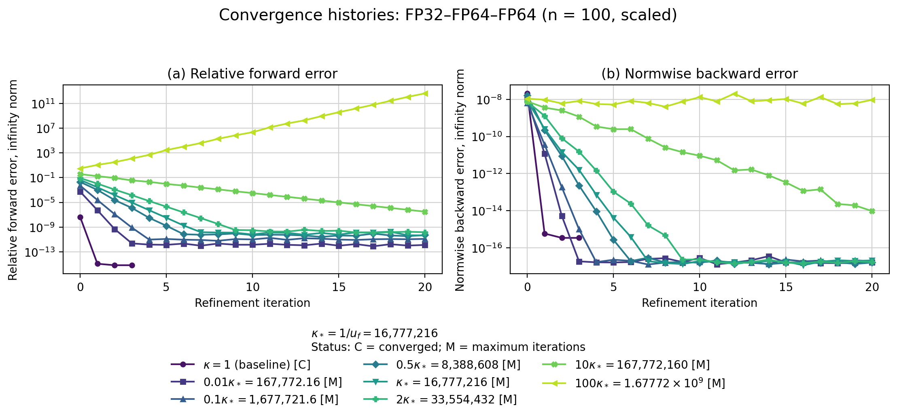
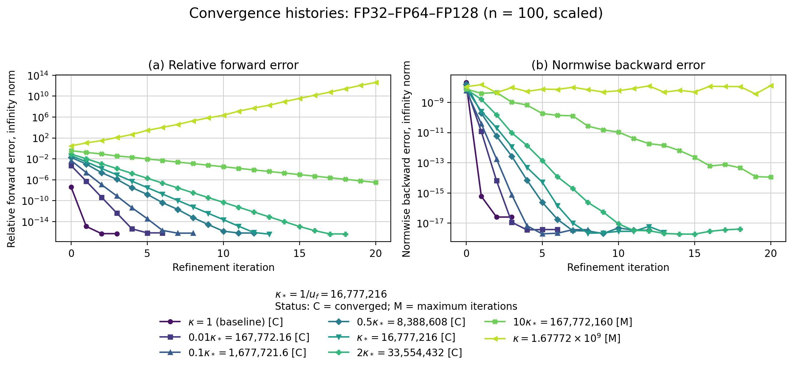
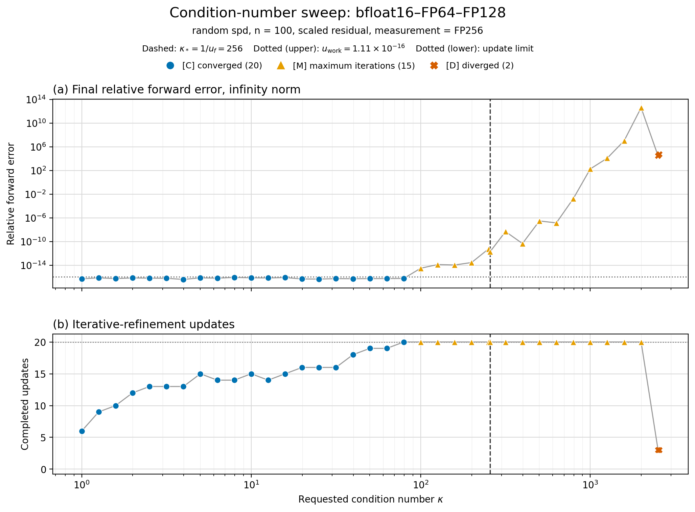
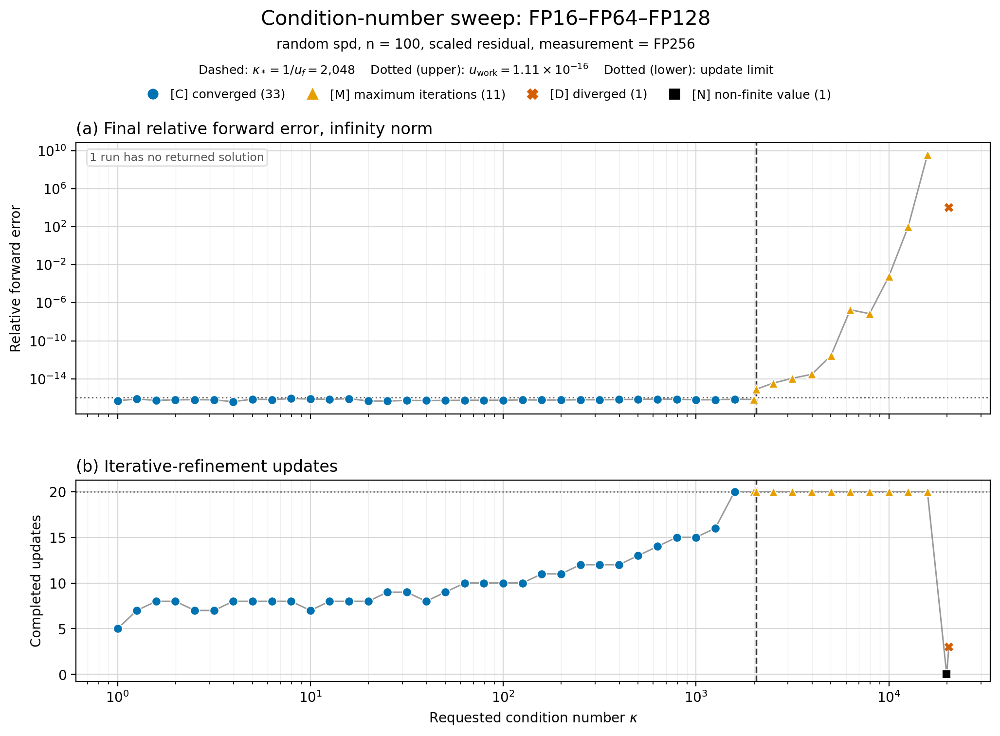
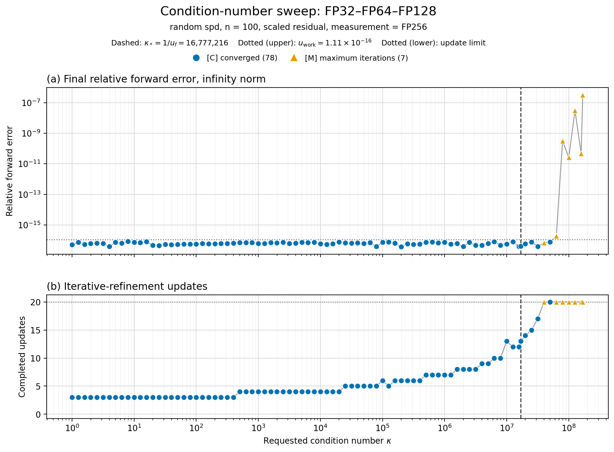
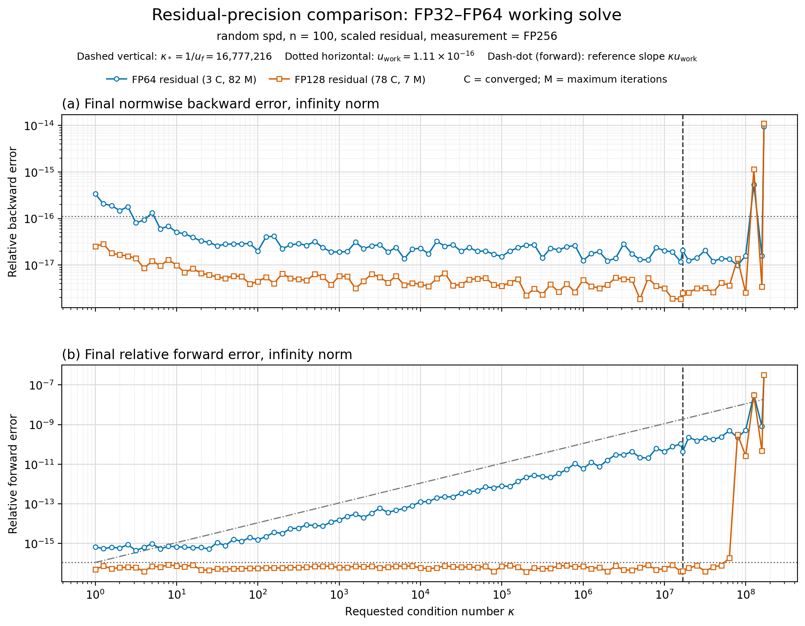

# Introduction

Modern hardware supports several floating-point formats with different
costs, accuracy, and numerical ranges. Low   precision can increase throughput
and reduce memory traffic and energy consumption, but it also introduces
larger rounding errors. Mixed-precision algorithms combine multiple formats
to obtain some of the efficiency of low precision while retaining higher-precision
accuracy [@highamMixedPrecisionAlgorithms2022].

This report studies mixed-precision iterative refinement for nonsingular
linear systems using low precision for LU factorization and higher precision for refinement.
Numerical experiments assess convergence and accuracy across precision triples and condition
numbers. The study focuses on convergence, attainable accuracy, and iteration counts, rather than
wall-clock performance. Several low- and high-precision formats are emulated or implemented in software,
so measured runtimes would not represent performance on hardware with native support for these formats.

# Three-precision iterative refinement

## Algorithm

The implemented method is LU-based three-precision iterative refinement
[@highamMixedPrecisionAlgorithms2022]:

```pseudocode
#| label: algo-mixed-ir
#| html-line-number: true
#| pdf-line-number: true
#| pdf-placement: "H"

\begin{algorithm}
\caption{Three-precision iterative refinement}
\begin{algorithmic}
\Require Nonsingular system $Ax=b$
\State Round $A$ and $b$ to precision $u_f$
\State Compute $PAQ=LU$ in precision $u_f$
\State Solve for $x_0$ using the factors in precision $u_f$
\State Store $x_0$ in precision $u$
\For{$i=0,1,\ldots,i_{\max}-1$}
    \State Compute $r_i=b-Ax_i$ in precision $u_r$
    \State Round $r_i$ to precision $u_f$
    \State Solve for $d_i$ using the factors in precision $u_f$
    \State Store $d_i$ in precision $u$
    \State $x_{i+1} \gets x_i+d_i$ in precision $u$
    \If{$\lVert d_i\rVert_2/\lVert x_i\rVert_2 < u$}
        \State \Return $x_{i+1}$
    \EndIf
\EndFor
\State \Return $x_{i_{\max}}$
\end{algorithmic}
\end{algorithm}
```

@algo-mixed-ir summarizes the core three-precision method. Our implementation
extends the core algorithm with optional residual scaling for limited-range formats,
configurable robustness checks, optional iterate histories, optional residual diagnostics,
and descriptive termination statuses. 


## Precision roles

The algorithm uses three unit roundoffs, typically ordered as

$$
u_r \leq u \leq u_f,
$$

where $u_f$, $u$, and $u_r$ are the unit roundoffs of the factorization, working,
and residual precisions, respectively.


## Convergence and attainable accuracy

Iterative refinement is expected to converge when

$$
\kappa(A)u_f<1.
$$

This is a useful approximate condition; convergence generally slows near this boundary. If the iteration converges, $u$ and $u_r$ determine the attainable accuracy. Higher residual precision reduces residual rounding errors and can improve the forward error [@carsonAcceleratingSolutionLinear2018].

# Experimental setup

The experiments use a common configurable framework in which explicit options configure both the test problem and the mixed-IR algorithm. Each driver selects these configurations, while shared components construct the problem, execute the algorithm, evaluate errors, and record the results.

## Configuration and common settings

Each experimental driver specifies the dimension, condition numbers, and precision types and configures the test problem and algorithm through separate option structures. `TestProblemOptions` controls problem construction, including the matrix family, right-hand-side mode, and random seeds, while `MixedIROptions` controls termination, residual scaling, and storage of iterate histories and residual diagnostics. Unless stated otherwise, the experiments use the common settings in @tbl-common-settings.


| Parameter                           | Common setting                                               |
| ----------------------------------- | ------------------------------------------------------------ |
| Matrix family                       | Dense random SPD                                             |
| Dimension                           | $n=100$                                                      |
| Right-hand side                     | $b_i\sim\mathcal{N}(0,1)$ in FP64                            |
| Random seeds                        | $42$ for matrix construction; $2718$ for the right-hand side |
| Working precision                   | FP64                                                         |
| Reference and measurement precision | FP256                                                        |
| Maximum iterations                  | $20$                                                         |
| Divergence detection                | Enabled; growth factor $10$ over three consecutive steps     |
| Residual scaling                    | Enabled                                                      |
| Iterate histories                   | Enabled                                                      |
| Residual diagnostics                | Disabled                                                     |

: Common experimental settings. {#tbl-common-settings}


The condition numbers and precision triples vary between experimental groups. Residual scaling normalizes the residual before conversion to the factorization precision and rescales the computed correction. It is disabled only for the scaled-unscaled comparison and is discussed later
under [Low-precision limitations and residual scaling](#sec-residual-scaling).

## Test problems 

The test-problem generator independently configures the matrix family and right-hand-side construction. It supports structured rotated-SPD, dense random-SPD, and nonsymmetric random-SVD matrices. Right-hand sides can be formed from an all-ones solution, a random-sign solution, or directly sampled normal entries. Unless stated otherwise, the experiments use dense random-SPD matrices and random-normal FP64 right-hand sides.

The random-SPD matrices have the form 

$$
A = Q\Lambda Q^T,
$$

with orthogonal $Q$ and prescribed condition number $\kappa_2(A)$. An FP256 solve of the stored system provides the reference solution.


## Precision formats

The experiments use the following formats:

| **Format** | **Implementation** | **Significand bits** | **Unit roundoff** |
| ---------- | ------------------ | -------------------- | ----------------- |
| bfloat16   | `CPFloat<8, 8>`    | 8                    | $2^{-8}$          |
| FP16       | `CPFloat<11, 5>`   | 11                   | $2^{-11}$         |
| FP32       | `float`            | 24                   | $2^{-24}$         |
| FP64       | `double`           | 53                   | $2^{-53}$         |
| FP128      | `FP<64>`           | 64                   | $2^{-64}$         |
| FP256      | `FP<192>`          | 192                  | $2^{-192}$        |

: Floating-point formats used in the experiments. {#tbl-precision-formats}

CPFloat simulates bfloat16 and FP16; GMP provides FP128 and FP256. The main experiments use FP64 working precision. Each experiment specifies its factorization and residual precisions.

## Error measures 

For each iterate, we compute

$$
\begin{aligned}
e_i &=
\frac{\lVert x_i-x_{\mathrm{ref}}\rVert_\infty}
     {\lVert x_{\mathrm{ref}}\rVert_\infty},
\\
\eta_i &=
\frac{\lVert b-Ax_i\rVert_\infty}
     {\lVert A\rVert_\infty\lVert x_i\rVert_\infty
      +\lVert b\rVert_\infty}.
\end{aligned}
$$

The forward error $e_i$ and the normwise backward error $\eta_i$ are both evaluated in FP256.

## Termination criteria and statuses

Convergence is determined by the relative correction

$$
\rho_i=\frac{\lVert d_i\rVert_2}{\lVert x_i\rVert_2}.
$$

Refinement terminates with status `converged` when $\rho_i < u$. 
Otherwise, it returns `max_iterations` after 20 iterations, 
`factorization_input_non_finite` if $A$ or $b$ is non-finite
after conversion to the factorization precision, 
`non-finite` if a non-finite value appears later, 
or `diverged` if the correction norm grows by more than a factor
of $10$ for three consecutive iterations.
The iteration limit, growth factor, and required number of consecutive
growth steps are configurable.


## Experimental framework and reproducibility

Each C++ driver defines an experimental group by selecting precision types and configuring
the shared test-problem, mixed-IR, measurement, and output components. 
Helper functions derive output paths, filenames, and common CSV fields from the configuration
and algorithm result. Drivers add only experiment-specific fields, such as iteration histories
or conversion diagnostics.

Each CSV records the run configuration, random seeds, and termination status.
Python scripts validate the raw data and generate plots without modifying it.
Fixed seeds and self-describing outputs allow runs to be repeated and figures
to be regenerated without rerunning the experiments.

# Experimental design

We conducted five groups of experiments to examine how conditioning, precision choices, and residual handling affect the convergence and accuracy of mixed iterative refinement. Unless stated otherwise, they use the common setup described above and vary only the parameters relevant to their objective. @tbl-experimental-design summarizes each group’s purpose, varied parameters, and recorded quantities.

| Experimental group            | Parameters varied                                         | Quantities recorded                                                  | Purpose                                                       |
| ----------------------------- | --------------------------------------------------------- | -------------------------------------------------------------------- | ------------------------------------------------------------- |
| Convergence histories         | Representative $\kappa_2(A)$ values and precision triples | Per-iteration forward error, backward error, relative correction; final status | Examine behavior below, near, and above $\kappa_2(A)u_f=1$.   |
| Condition-number sweep        | $\kappa_2(A)$ and precision triple                        | Final forward error, iteration count, final status                   | Determine how conditioning affects convergence and accuracy.  |
| Residual-precision comparison | $\kappa_2(A)$ and residual precision                                        | Final forward and backward errors, final status                                          | Measure the benefit of higher residual precision.             |
| Direct-solve comparison       | $\kappa_2(A)$ and solution method                                           | Final forward and backward errors, final status                                          | Compare mixed IR with a direct working-precision solve.       |
| Residual-scaling experiments  | Residual scaling enabled or disabled                      | Error histories and conversion diagnostics                           | Determine whether scaling prevents residual information loss. |

: Overview of the five experimental groups. {#tbl-experimental-design tbl-colwidths="[20,25,27,28]"}


# Results and discussion

## Convergence histories

In this experiment group $u_f$, $u_r$ and $\kappa(A)$ are varied; $u$ and other common settings remain fixed. For each configuration, the forward error, backward error, and relative correction are recorded after every refinement step, Relative corrections are omitted from the final plots.
These histories show the convergence rate, attained accuracy, and termination status.

For each factorization precision, the driver defines the reference condition number

$$
\kappa_* = u_f^{-1}
$$

and tests $\kappa_2(A)=1$ together with representative values below, near, and above $\kappa_*$. Condition numbers are chosen as multiples of $\kappa_*$ to provide a common relative scale across factorization formats. The condition $\kappa_2(A)u_f<1$ serves as an approximate theoretical reference. 

Curve labels include termination status. `C`, `M`, `D`, and `F` denote convergence, the iteration limit, detected divergence, and non-finite factorization input, respectively.

Four precision configurations are presented: FP16-FP64-FP64, FP16-FP64-FP128, FP32-FP64-FP64, and FP32-FP64-F128.
They form a $2 \times 2$ precision design with two factorization precisions and two residual precisions. 
This selection enables matched comparisons of how $u_r$ affects the convergence history and attainable forward error at fixed factorization precision. It also shows how the convergence scale changes with $u_f$.
The omitted FP8 and bfloat16 configurations examine alternative low-precision
factorization formats and are summarized after the main comparison. 

The convergence results are shown in @fig-convergence-histories


::: {#fig-convergence-histories layout-ncol=1 fig-pos="p"}

{#fig-convergence-uf_fp16-ur_fp128 width=81%}

{
    #fig-convergence-uf_fp16-ur_fp128 width=81%
}

{
    #fig-convergence-uf_fp32-ur_fp128 width=81%
}


{
    #fig-convergence-uf_fp32-ur_fp64 width=81%
}

:::

### Interpretation

Across all four displayed triples, convergence slows as the condition number increases. Runs well below $\kappa_*$ converge rapidly; runs near $\kappa_*$ require more iterations, while runs sufficiently far above it reach the iteration limit or diverge. 
The transition occurs at different multiples of $\kappa_*$, consistent with $\kappa_*=u_f^{-1}$ being an approximate reference rather than a fixed convergence boundary.

The $2\times2$ design separates the roles of the two precisions: $u_f$ primarily determines the convergence rate and practical convergence region, whereas $u_r$ primarily determines the attainable forward accuracy. The following subsections examine these effects and summarize the omitted FP8 and bfloat16 configurations.


#### *Effect of residual precision*

At each factorization precision, the FP64- and FP128-residual histories are initially nearly identical and separate only at the FP64 accuracy floor. Thus, $u_r$ primarily controls attainable accuracy, not the initial convergence rate.

With FP64 residuals, $u_r=u$, and the forward error reaches a condition-dependent plateau. For FP16 factorization, runs from $0.01\kappa_*$ through $\kappa_*$ stagnate between $10^{-15}$ and $10^{-14}$ and reach the iteration limit. For FP32, the larger absolute condition numbers produce clearer plateaus, rising from approximately $10^{-12}$ at $0.01\kappa_*$ to $10^{-10}$ at $2\kappa_*$. The backward errors still approach working-precision accuracy. This agrees with the expected forward-error limit $O(\operatorname{cond}(A,x)u)$.

FP128 residuals reduce these plateaus. For FP16, runs through $0.5\kappa_*$ converge with forward errors of order $10^{-16}$; at $\kappa_*$, the error reaches approximately $8\times10^{-16}$ without satisfying the stopping criterion within 20 iterations. For FP32, all runs through $2\kappa_*$ converge with errors between $4\times10^{-17}$ and $7\times10^{-17}$. Backward errors are also lower, and more runs converge.

Once factorization limits convergence, both residual precisions produce nearly identical histories: from $2\kappa_*$ upward for FP16 and $10\kappa_*$ upward for FP32. Higher residual precision therefore improves stable runs but cannot prevent factorization-induced instability. Since HDNUM FP128 does not nominally satisfy $u_r=u^2$, these results demonstrate the benefit of $u_r<u$, but not the sufficient theoretical case $u_r=u^2$.

#### *Factorization precision and convergence scale*

At fixed residual precision, increasing factorization precision shifts convergence to larger absolute condition numbers. The reference values are

$$
\kappa_*^{\mathrm{FP16}}=2^{11}=2{,}048,
\qquad
\kappa_*^{\mathrm{FP32}}=2^{24}=16{,}777{,}216,
$$

giving FP32 an $8{,}192$ times larger convergence scale. At comparable $\kappa/\kappa_*$, both formats converge rapidly below $\kappa_*$, more slowly near it, and slowly or not at all sufficiently far above it. With FP128 residuals, FP16 converges through $0.5\kappa_*$ and FP32 through $2\kappa_*$. This is consistent with $\kappa_*$ being an approximate reference rather than a fixed boundary.

Because each format uses its own normalized condition-number grid, the comparison involves different matrices and absolute condition numbers. It therefore shows convergence relative to each format’s scale, not the effect of changing $u_f$ for the same system.


#### *Alternative low-precision factorization formats*

The bfloat16 and FP8 configurations were omitted to preserve the complete $2\times2$ FP16/FP32 design. They examine distinct low-precision formats and do not form a controlled pair.

Bfloat16 has lower significand precision than FP16 but a larger exponent range. It converges through $0.1\kappa_*$ but not from $0.5\kappa_*$ upward; divergence is detected at $10\kappa_*$. On the normalized grid, it converges more slowly than FP16. Its larger range provides no visible advantage here because residual scaling prevents underflow and no factorization-input range failure occurs.

FP8 is an extreme stress case. It converges at $\kappa=1$ and $0.1\kappa_*$ in 10 and 17 steps, respectively, but reaches the iteration limit from $0.5\kappa_*$ through $10\kappa_*$. At $100\kappa_*$, conversion to FP8 produces non-finite input and factorization stops before refinement. These results expose the limitations of very low factorization precision but are secondary to the isolated $u_f$ and $u_r$ comparisons.


## Condition-number sweep

This experiment uses a dense logarithmic sweep to map final accuracy and iteration count over a broad condition-number range. For each factorization format, $\kappa_2(A)$ ranges from $1$ to approximately $10\kappa_*$, where $\kappa_*=u_f^{-1}$. The working and residual precisions remain fixed at FP64 and FP128. The upper panels show the final relative forward error; the lower panels show completed refinement updates. Dashed lines mark $\kappa_*$, dotted lines mark $u$ and the 20-update limit, and marker shapes indicate termination status.

Three configurations are shown: bfloat16-FP64-FP128, FP16-FP64-FP128, and FP32-FP64-FP128. Fixing $u$ and $u_r$ isolates the 
effect of factorization precision. The FP8 configuration is omitted as an extreme stress case and summarized below. The FP64-residual
configurations are also omitted because their main effect was examined in the preceding experiment group. 

The results are shown in @fig-condition-sweeps

::: {#fig-condition-sweeps layout-ncol=1 fig-pos="p"}

{#fig-condition-sweep-uf_bfloat16 width=70%}

{#fig-condition-sweep-uf_fp16 width=70%}


{#fig-condition-sweep-uf_fp32 width=70%}

:::


### Interpretation

Across the three sweeps, increasing $\kappa_2(A)$ generally increases the required updates. The status totals are $20$ converged, $15$ maximum-iteration, and $2$ diverged runs for bfloat16; $33$ converged, $11$ maximum-iteration, $1$ diverged, and $1$ non-finite run for FP16; and $78$ converged and $7$ maximum-iteration runs for FP32. Since the grids contain different numbers of points, these totals describe each sweep but are not directly comparable success rates. Converged runs retain forward errors near working precision until the practical convergence limit is approached.

#### *Conditioning and practical convergence region*

Within each format, well-conditioned systems converge in few updates, while the update count rises toward the transition region. The first maximum-iteration runs occur at approximately $0.39\kappa_*$ for bfloat16, $0.97\kappa_*$ for FP16, and $2.37\kappa_*$ for FP32. The largest converged values are $0.31\kappa_*$, $0.77\kappa_*$, and $2.99\kappa_*$, respectively. Thus, higher factorization precision expands the practical convergence region on both absolute and normalized scales in these tests.

This trend is consistent with the theoretical convergence factor being of order $u_f\kappa(A)$, but $\kappa_*=u_f^{-1}$ is only an approximate scale. LU growth, factorization quality, componentwise conditioning, and norm-dependent constants also affect convergence. The normalized transition therefore need not occur at $\kappa/\kappa_*=1$ or remain fixed across formats.


#### *Final forward accuracy*

Converged runs generally attain forward errors of order $u$. Increasing $\kappa_2(A)$ mainly raises the update count; final accuracy remains near working precision while refinement succeeds. The FP128 residual therefore avoids the condition-dependent floor observed with FP64 residuals.

Near the transition, some runs retain small errors but reach the 20-update limit because termination depends on the relative correction, not the forward error. Beyond this region, errors increase or become irregular. Final error must therefore be interpreted together with termination status.

#### *Omitted configurations*

FP8–FP64–FP128 is omitted as an extreme stress case: only 3 of 25 runs converge, up to approximately $0.10\kappa_*$. The FP16–FP64–FP64 and FP32–FP64–FP64 sweeps mainly reproduce the condition-dependent accuracy floor observed in the preceding experiment group. Only three runs in each sweep converge; most reach the 20-update limit because the correction criterion remains unsatisfied. The residual-precision experiment examines this effect directly.

```{=latex}
\clearpage
```

## Residual-precision comparison

This experiment isolates the effect of residual precision. The factorization and working precisions are fixed at FP32 and FP64, while the residual precision is varied between FP64 and FP128. Both configurations use the same matrices, right-hand sides, condition-number grid, and algorithmic settings. Residual scaling is enabled, and errors are evaluated in FP256.

The upper panel shows the final normwise backward error; the lower panel shows the final relative forward error. The dashed line marks $\kappa_*=u_f^{-1}$, while the dotted lines mark $u$ and the reference $\kappa_2(A)u$. Marker shapes indicate termination status.

The results are shown in @fig-residual-comparison.

{#fig-residual-comparison width="75%"}

### Interpretation

Across the stable range, both configurations attain backward errors of order $u$. Their forward errors separate as $\kappa_2(A)$ increases: with FP64 residuals, the error grows approximately in proportion to $\kappa_2(A)$, whereas with FP128 residuals it remains near working precision. Beyond the factorization convergence region, both variants become irregular.


#### *Backward error*

Over the stable range $10^2\leq\kappa_2(A)\leq10^7$, both backward-error curves are nearly independent of conditioning. FP64 residuals give errors between $1.2\times10^{-17}$ and $4.2\times10^{-17}$, while FP128 residuals give approximately $1.9\times10^{-18}$ to $6.7\times10^{-18}$. Both remain of order $u$.

FP128 residuals lower the observed values but do not change their theoretical order. This agrees with @carsonAcceleratingSolutionLinear2018 [Corollary 4.2], which predicts a limiting normwise backward error of order $u$, essentially independent of $u_r$. Values below $u$ do not contradict this result, since the estimate specifies an order rather than a lower bound.


#### *Forward error and residual precision*

Over the stable range $10^2\leq\kappa_2(A)\leq10^7$, FP64 residuals produce forward errors from approximately $1.5\times10^{-15}$ to $4.3\times10^{-11}$. Their log–log slope is $0.90$, close to the predicted linear dependence on conditioning. With FP128 residuals, the error remains between approximately $3.8\times10^{-17}$ and $8.1\times10^{-17}$, with no systematic dependence on $\kappa_2(A)$ and near working precision.

This agrees with the limiting bound

$$
\frac{\lVert \widehat{x}-x\rVert_\infty}{\lVert x\rVert_\infty}
\lesssim
u+4pu_r\operatorname{cond}(A,x)
$$

of @carsonAcceleratingSolutionLinear2018 [Corollary 3.3]. When $u_r=u$, the condition-dependent term gives an error of order $\operatorname{cond}(A,x)u$. With sufficiently accurate residuals, this term becomes negligible and the limiting error is of order $u$. Since $\kappa_2(A)$ is used as a proxy for $\operatorname{cond}(A,x)$, the plotted $\kappa_2(A)u$ line represents the expected scaling rather than an exact bound.

Only 3 of the 85 FP64-residual runs satisfy the stopping criterion; the remaining 82 reach the update limit. This mainly reflects the condition-dependent correction floor remaining above the $u$-based tolerance, even after the forward error reaches its expected level. With FP128 residuals, 78 runs converge and 7 reach the update limit. Beyond the FP32 factorization convergence region, however, both variants become irregular. Higher residual precision improves attainable accuracy but cannot compensate for an insufficiently accurate factorization.


## Direct-solve comparison

...

## Low-precision limitations and residual scaling {#sec-residual-scaling}

...

# Conclusion

...

# References {.unnumbered}